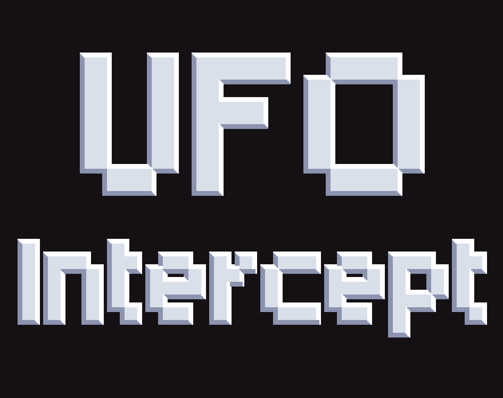

# UFO Intercept

  
  
<i>Click to play on itch.io</i>

Space Invaders type game in HTML Canvas element.
This is currently in an initial state where the main system is built and ready for features to be added.

## Story

An alien force has been detected, and they are building their army in preperation to attach us. We will send a small fleet to intercept them before they are too strong for us to defend. Interupting there development, and stealing their tech may give the advantage we need to succeed.

## Featres

- space invader like levels leading to bosses
- 3 bosses at 5 level intervals (5, 10, 15)
- bonus ships the will drop temporary power ups when destroyed
- multiple levels of power ups
- permenant power up can be equipped after boss, available items based on the number of power ups collected
- random power up added to alien swarm levels based on bonus ships not destroyed
